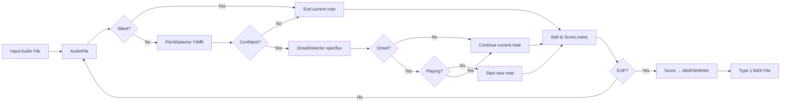

# midicapture — Design Document

> Audio-to-MIDI transcription module. Converts audio recordings (AIFF, WAV, FLAC) to Standard MIDI Files (SMF).

---

## 1. Purpose

`midicapture` is a command-line utility that analyzes audio recordings and generates **Type 1 MIDI files** (480 ticks per quarter note), compatible with Apple Logic Pro. It is the second phase of the Audio project.

The module uses:
- **aubio** (via libaudio): Pitch detection (YINfft), onset detection (spectral flux)
- **libsndfile** (via libaudio): Audio file I/O (AIFF, WAV, FLAC, etc.)
- **Boost program_options**: Command-line argument parsing

---

## 2. Architecture

```
Audio/
├── libaudio/             # DSP library (pitch, onsets, MIDI writing)
│   ├── include/libaudio/
│   │   ├── pitch.h       # PitchDetector (YINfft, YINfast, fcomb, Schmitt)
│   │   ├── onset.h       # OnsetDetector (specflux, energy, hpsst, phase, combs)
│   │   ├── audioFile.h   # AudioFileReader (libsndfile wrapper)
│   │   ├── midiFileWriter.h  # MidiFileWriter (HIR → SMF)
│   │   └── hir.h         # Note, ControlEvent, Score (HIR)
│   └── src/             # Implementation files
├── midicapture/          # Phase 2: Audio → MIDI
│   ├── CMakeLists.txt   # Build config (libaudio, Boost)
│   ├── include/midicapture/
│   │   ├── transcriber.h         # High-level transcription API
│   │   └── audioFile.h           # Audio file reading (libsndfile)
│   └── src/
│       ├── main.cpp              # CLI entry point (Boost program_options)
│       ├── transcriber.cpp       # Transcription pipeline (pitch + onset)
│       └── audioFile.cpp         # Audio file I/O (libsndfile)
└── lode/midicapture/    # Module documentation
```

---

## 3. Transcription Pipeline



---

## 4. State Machine (Monophonic)

The monophonic prototype uses a simple two-state machine:

| State | Condition | Action |
|-------|-----------|--------|
| **IDLE** | Confidence < threshold | Wait for onset |
| **PLAYING** | Confidence ≥ threshold | Track note, watch for note-off |

Transitions:
- **IDLE → PLAYING**: Confidence ≥ threshold AND onset detected
- **PLAYING → IDLE**: Confidence < threshold (note-off) or new onset

---

## 5. Key Design Decisions

| Decision | Value | Rationale |
|----------|-------|-----------|
| **Pitch method** | YINfft (default) | Best accuracy/speed tradeoff for piano |
| **Onset method** | Spectral flux | Most reliable for piano transients |
| **Window size** | 2048 (configurable) | 43 ms at 48 kHz, good balance |
| **Hop size** | 512 (75% overlap) | Good latency vs. smoothing |
| **Confidence threshold** | 0.5 (configurable) | Moderate sensitivity for piano |
| **Silence threshold** | -40 dB (configurable) | Filters out background noise |
| **MIDI format** | Type 1, 480 ticks/qn | Logic Pro compatible |
| **CLI library** | Boost program_options | Standard, robust, extensible |

---

## 6. CLI Interface

```bash
midicapture [options] <input.aiff> <output.mid>

Options:
  --window-size <int>       FFT window size (default: 2048)
  --hop-size <int>          Hop size (default: 512)
  --confidence <float>      Confidence threshold (default: 0.5)
  --silence <float>         Silence threshold in dB (default: -40)
  --tempo <float>           Tempo in BPM (default: 120)
  --method <string>         Pitch method (default: "yinfft")
  --help                    Print usage
```

---

## 7. Build

```bash
cd midicapture
mkdir build && cd build
cmake .. -DCMAKE_BUILD_TYPE=Release
cmake --build . --config Release
```

Requires: aubio, libsndfile, Boost (program_options).

---

## 8. Cross-References

- **libaudio**: `lode/libaudio/summary.md`, `lode/libaudio/decisions.md`, `lode/libaudio/hir.md`
- **MIDI format**: `lode/MIDI.md`
- **aiffcapture**: `lode/aiffcapture/summary.md`
- **Project overview**: `lode/summary.md`
