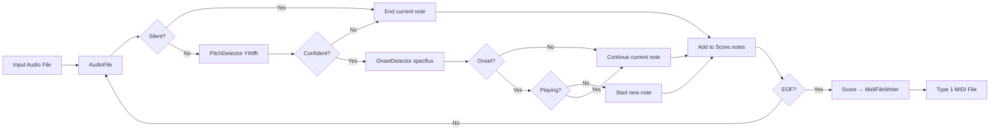

# midicapture — Design Document

> Audio-to-MIDI transcription module. Converts audio recordings (AIFF, WAV, FLAC) to Standard MIDI Files (SMF).

---

## 1. Purpose

`midicapture` is a command-line utility that analyzes audio recordings and generates **Type 1 MIDI files** (480 ticks per quarter note), compatible with Apple Logic Pro. It is the second phase of the Audio project.

The module uses:
- **aubio** (via libaudio): Pitch detection (YINfft), onset detection (spectral flux)
- **libsndfile** (via libaudio): Audio file I/O (AIFF, WAV, FLAC, etc.)
- **Boost program_options**: Command-line argument parsing

---

## 2. Architecture

```
Audio/
├── libaudio/             # DSP library (pitch, onsets, MIDI writing)
│   ├── include/libaudio/
│   │   ├── pitch.h       # PitchDetector (YINfft, YINfast, fcomb, Schmitt)
│   │   ├── onset.h       # OnsetDetector (specflux, energy, hpsst, phase, combs)
│   │   ├── audioFile.h   # AudioFileReader (libsndfile wrapper)
│   │   ├── midiFileWriter.h  # MidiFileWriter (HIR → SMF)
│   │   └── hir.h         # Note, ControlEvent, Score (HIR)
│   └── src/             # Implementation files
├── midicapture/          # Phase 2: Audio → MIDI
│   ├── CMakeLists.txt   # Build config (libaudio, Boost)
│   ├── include/midicapture/
│   │   ├── transcriber.h         # High-level transcription API
│   │   └── audioFile.h           # Audio file reading (libsndfile)
│   └── src/
│       ├── main.cpp              # CLI entry point (Boost program_options)
│       ├── transcriber.cpp       # Transcription pipeline (pitch + onset)
│       └── audioFile.cpp         # Audio file I/O (libsndfile)
└── lode/midicapture/    # Module documentation
```

---

## 3. Transcription Pipeline



---

## 4. State Machine (Monophonic)

The monophonic prototype uses a simple two-state machine:

| State | Condition | Action |
|-------|-----------|--------|
| **IDLE** | Confidence < threshold | Wait for onset |
| **PLAYING** | Confidence ≥ threshold | Track note, watch for note-off |

Transitions:
- **IDLE → PLAYING**: Confidence ≥ threshold AND onset detected
- **PLAYING → IDLE**: Confidence < threshold (note-off) or new onset

---

## 5. Key Design Decisions

| Decision | Value | Rationale |
|----------|-------|-----------|
| **Pitch method** | YINfft (default) | Best accuracy/speed tradeoff for piano |
| **Onset method** | Spectral flux | Most reliable for piano transients |
| **Window size** | 2048 (configurable) | 43 ms at 48 kHz, good balance |
| **Hop size** | 512 (75% overlap) | Good latency vs. smoothing |
| **Confidence threshold** | 0.5 (configurable) | Moderate sensitivity for piano |
| **Silence threshold** | -40 dB (configurable) | Filters out background noise |
| **MIDI format** | Type 1, 480 ticks/qn | Logic Pro compatible |
| **CLI library** | Boost program_options | Standard, robust, extensible |

---

## 6. CLI Interface

`--input` / `-i` and `--output` / `-o` are both optional. When `--input` is
provided without `--output`, the output path defaults to `<input>.mid` (extension
replaced).

`--help` prints a POSIX-style help message with a `Usage:` line and exits — no
input file required.

```
midicapture — audio-to-MIDI transcription

Usage: ./midicapture [options] <input.aiff> [output.mid]

Main options:
  -h [ --help ]             Print usage information.
  -i [ --input ] arg        Input audio file path (AIFF, WAV, FLAC, etc.).
  -o [ --output ] arg       Output MIDI file path (.mid).
  --window-size arg (=2048) FFT window size (power of 2, default: 2048).
  --hop-size arg (=512)     Hop size between frames (default: 512).
  --confidence arg (=0.5)   Pitch detection confidence threshold (0.0–1.0,
                            default: 0.5).
  --silence arg (=-40)      Silence threshold in dB (default: -40).
  --tempo arg (=120)        Tempo in BPM (default: 120).
  --method arg (=yinfft)    Pitch detection method (default: "yinfft").
```

Examples:
```bash
midicapture song.aiff                          # → song.mid
midicapture song.aiff output.mid               # explicit output
midicapture -i song.aiff                       # → song.mid
midicapture --input song.aiff --output out.mid # explicit output
midicapture --help                             # usage only
```

---

## 7. Build

```bash
cd midicapture
mkdir build && cd build
cmake .. -DCMAKE_BUILD_TYPE=Release
cmake --build . --config Release
```

Requires: aubio, libsndfile, Boost (program_options).

---

## 8. Known Bugs (2026-09-20)

### Bug: `secondsToTicks` formula off by 60×

**File:** `libaudio/src/midiFileWriter.cpp`

The formula divides by 60 twice:

```cpp
seconds * (TICKS_PER_QUARTER_NOTE / 60.0) * (tempoBPM / 60.0)
// = seconds × (480/60) × (120/60) = seconds × 16  (WRONG)
// Should be: seconds × (480 × 120/60) = seconds × 960
```

**Impact:** All MIDI note times are 60× too short. Notes at 5.7s appear
at 91 ticks (0.095s correct time). The MIDI file is structurally valid
but semantically wrong.

**Fix:** Remove one division by 60:

```cpp
seconds * TICKS_PER_QUARTER_NOTE * (tempoBPM / 60.0)
```

### Bug: Transcription detects far too few notes

Only 2 notes detected from a ~30s Final Fantasy AIFF (C2 and A#5),
both with very low velocities (15 and 8). Suspected causes:
- Onset detection threshold (default 0.2) too high for the recording
- Confidence threshold (default 0.5) too high
- State machine flickering creates duplicate NoteOn/NoteOff pairs
- Stereo-to-mono downmix quality issues

### Bug: `ffprobe` reports "Invalid data" on valid tiny MIDI files

71-byte MIDI files are structurally valid but below ffprobe's probe
buffer threshold. This is a false positive from ffprobe, not a real
file error.

---

## 9. Cross-References

- **libaudio**: `lode/libaudio/summary.md`, `lode/libaudio/decisions.md`, `lode/libaudio/hir.md`
- **MIDI format**: `lode/MIDI.md`
- **aiffcapture**: `lode/aiffcapture/summary.md`
- **Session handoff**: `lode/tmp/session-handoff-midicapture-diagnosis.md`
- **Project overview**: `lode/summary.md`
