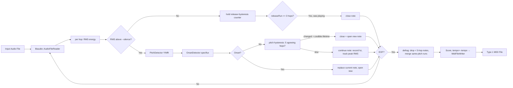

# midicapture — Design Document

> Audio-to-MIDI transcription module. Converts audio recordings (AIFF, WAV, FLAC) to Standard MIDI Files (SMF).

---

## 1. Purpose

`midicapture` is a command-line utility that analyzes audio recordings and generates **Type 1 MIDI files** (480 ticks per quarter note), compatible with Apple Logic Pro. It is the second phase of the Audio project.

The module uses:
- **aubio** (via libaudio): Pitch detection (YINfft), onset detection (spectral flux)
- **libsndfile** (via libaudio): Audio file I/O (AIFF, WAV, FLAC, etc.)
- **Boost program_options**: Command-line argument parsing

---

## 2. Architecture

```
Audio/
├── libaudio/             # DSP library (pitch, onsets, MIDI writing)
│   ├── include/libaudio/
│   │   ├── pitch.h       # PitchDetector (YINfft, YINfast, fcomb, Schmitt)
│   │   ├── onset.h       # OnsetDetector (specflux, energy, hpsst, phase, combs)
│   │   ├── audioFile.h   # AudioFileReader (libsndfile wrapper)
│   │   ├── midiFileWriter.h  # MidiFileWriter (HIR → SMF)
│   │   └── hir.h         # Note, ControlEvent, Score (HIR)
│   └── src/             # Implementation files
├── midicapture/          # Phase 2: Audio → MIDI
│   ├── CMakeLists.txt   # Build config (libaudio, Boost)
│   ├── include/midicapture/
│   │   └── transcriber.h         # High-level transcription API
│   └── src/
│       ├── main.cpp              # CLI entry point (Boost program_options)
│       └── transcriber.cpp       # Transcription pipeline (pitch + onset)
└── lode/midicapture/    # Module documentation
```

---

## 3. Transcription Pipeline



---

## 4. State Machine (Monophonic, energy-gated)

The monophonic prototype uses a two-state machine gated on **energy**, not on
the pitch detector's confidence (YINfft reports a usable fundamental even for
noise; on rendered piano its confidence reads ~0, so it is not a usable gate).

| State | Condition | Action |
|-------|-----------|--------|
| **IDLE** | No note active | Wait for an onset on a tonal hop |
| **PLAYING** | A note is active | Record hz + peak RMS; watch for release, onset, or a stable pitch change |

Transitions:
- **IDLE → PLAYING**: onset detected on a tonal hop (RMS above `--silence`).
- **PLAYING → IDLE** (any of):
  - **release** — energy stays below `--silence − 10 dB` for `kReleaseHops = 3` hops;
  - **onset** — a new onset replaces the current note;
  - **pitch change** — `kPitchStability = 5` consecutive hops agree on a *different* pitch class, *and* the in-flight note is ≥ `kMinReplaceHops = 5` hops (younger than that the change is treated as wobble within the same note).

A note that closes with fewer than `kMinNoteHops = 5` hops is dropped (see §8).
A decaying note that is closed and re-opened hop to hop by its own wobble is
recombined into a single note by the same-pitch merge in §8.

---

## 5. Key Design Decisions

| Decision | Value | Rationale |
|----------|-------|-----------|
| **Pitch method** | YINfft (default) | Best accuracy/speed tradeoff for piano |
| **Onset method** | Spectral flux | Most reliable for piano transients |
| **Window size** | 2048 (configurable) | 43 ms at 48 kHz, good balance |
| **Hop size** | 512 (10.7 ms at 48 kHz) | Good latency vs. smoothing |
| **Silence threshold** | -40 dB (configurable) | Note on/off hysteresis level |
| **Release hysteresis** | -10 dB, 3 hops | A note disarms only after 3 quiet hops |
| **Pitch stability** | 5 hops (100 ms) | A pitch change needs 5 agreeing hops |
| **Min note lifetime** | 5 hops | Drops the wobble-fragment debris |
| **Min replace lifetime** | 5 hops | A note must be credible before it is replaced |
| **Tempo** | from `--tempo` (120) | Drives the merge gap + MIDI ticks |
| **MIDI format** | Type 1, 480 ticks/qn | Logic Pro compatible |
| **CLI library** | Boost program_options | Standard, robust, extensible |

---

## 6. CLI Interface

An input file is required, **except** in `--test` mode (which needs none) or
`--generate-test-midi-files` mode (which writes a set of files and needs no
input at all — see [testmidi.md](testmidi.md)).
When `--input` is given without `--output`, the output path defaults to
`<input>.mid` (extension replaced); in `--test` mode with no input it
defaults to `midicapture-test.mid`.

`--help` prints a POSIX-style help message with a `Usage:` line and exits — no
input file required.

```
midicapture — audio-to-MIDI transcription

Usage: ./midicapture [options] <input.aiff> [output.mid]

Main options:
  -h [ --help ]             Print usage information.
  -i [ --input ] arg        Input audio file path (AIFF, WAV, FLAC, etc.).
  -o [ --output ] arg       Output MIDI file path (.mid).
  --window-size arg (=2048) FFT window size (power of 2, default: 2048).
  --hop-size arg (=512)     Hop size between frames (default: 512).
  --silence arg (=-40)      Silence threshold in dB (default: -40) — note
                            on/off hysteresis level.
  --tempo arg (=120)        Tempo in BPM (default: 120) — drives the merge
                            gap and the MIDI tick conversion.
  --method arg (=yinfft)    Pitch detection method (default: "yinfft").
  -t [ --test ]             Sanity test: write a single middle-C note
                            (C4, velocity 100, 1s) regardless of input.
  --generate-test-midi-files
                            Generate a set of simple monophonic scale MIDI files
                            in --output-dir (default: CWD). All other options
                            are ignored.
```

Examples:
```bash
midicapture song.aiff                          # → song.mid
midicapture song.aiff output.mid               # explicit output
midicapture -i song.aiff                       # → song.mid
midicapture --input song.aiff --output out.mid # explicit output
midicapture --help                             # usage only
midicapture --test song.aiff                   # fixed sanity note -> song.mid
midicapture -t --output sanity.mid             # sanity note, no input needed
midicapture --generate-test-midi-files            # 6 scale files in CWD
midicapture --generate-test-midi-files --output-dir ./test-midi
```

---

## 7. Build

```bash
cd midicapture
mkdir build && cd build
cmake .. -DCMAKE_BUILD_TYPE=Release
cmake --build . --config Release
```

Requires: aubio, libsndfile, Boost (program_options).

---

## 8. Validation & Known Issues

The writer is **validated, not a bug** — see [writer.md](writer.md). What
remains open is transcription quality.

### Validation toolchain (decided: not ffprobe)

`ffprobe` is **not** authoritative for small MIDI files — it reports
"Invalid data" on valid ones. We validate with:
- **`midicsv <file>`** — parses to CSV; a clean parse = structurally valid.
- **`timidity -Ow out.wav <file>`** — renders audio; `Notes lost totally: 0`
  and a correctly-timed note = semantically valid.

The writer round-trips cleanly through both (53-byte `--test` file;
clean 62-byte real-transcription file on `aiffcapture/final-fantasy.aiff`).

### Resolved: segfault on stereo input (heap buffer overflow)

**Symptom:** `midicapture` crashed with a segfault on any stereo audio
file (e.g., the 44.1 kHz stereo WAV test files from `--generate-test-midi-files`).

**Root cause:** In `Transcriber::transcribe()`, the audio buffer was sized
`bufSize` (2048 floats). For stereo files, `sf_readf_float(file, buffer,
2048)` writes `2048 × 2 = 4096` floats into that 2048-float buffer — a heap
buffer overflow on every frame, corrupting adjacent heap memory until a
segfault.

**Fix:** Buffer is now sized `bufSize × channels` to accommodate interleaved
stereo data. After the in-place downmix in `AudioFileReader::read()`, the
first `framesRead` positions hold valid mono samples; a partial read near EOF
is zero-padded to `hopSize` before the detectors. **Status:** Fixed.

### Resolved: decaying-note fragmentation (WIP → fixed 2026-09-23)

**Symptom (superseded the old "~2 notes" issue):** a *dense* passage produced
hundreds of ~10 ms notes — a 30 s `final-fantasy.aiff` gave **1447 notes** at
`--silence -40`, with median duration 1 hop and up to 55 consecutive same-pitch
1-hop fragments. The root cause is **not** the release hysteresis failing to
fire: a decaying piano note is *closed and re-opened hop to hop* by its own
spectral-flux wobble (a flux blip closes the note, the lagged window still
reports the old pitch, a fragment opens), and its peak RMS decays so the 3-hop
off-threshold is never reached inside a dense passage.

**Fix (defragmentation):**
1. `kMinNoteHops = 5` — a note that closes younger than 5 hops (100 ms) is
dropped, removing the 1–3 hop wobble debris.
2. `kMinReplaceHops = 5` — a pitch-change / onset may *replace* an in-flight
note only once it has a credible lifetime; younger than that the "change" is
wobble within the same sustained note.
3. **Same-pitch merge** — after the scan, consecutive same-pitch fragments
closer than a quarter-note gap (`60/tempo · 0.5` s) are joined into one note
(earliest start, latest end). This recombines a wobble-fragmented sustained
note that the in-loop rules alone cannot (they see the *current* note's
placeholder pitch, not the final stamped one).
4. **Velocity** = loudest hop-RMS over the merged lifetime (one
attack-and-decay, not per-hop tremolo); the new-note start is back-dated one
hop for the attack-window lag.

**Measured effect:** `final-fantasy.aiff` **1447 → 101 notes** (the handoff
"hundreds, not 1447" target), F#/E/G# content, sensibly spaced. On the
6-scale round-trip corpus defrag reduces fragments to a plausible note count
and, for the chromatic scale, *preserves the ascending pitch sequence*
(E3→…→F#2). See the open octave limitation below.

### Open: octave ambiguity on weak-fundamental recordings

A *decaying* note's lifetime-mean frequency drifts to a **sub-octave** of the
true fundamental (YIN is a harmonic estimator; measured **91 Hz mean for a
440 Hz note** on the `timidity` scale renders, with the loudest hop also at
~90 Hz — *all* estimates sit 1–2 octaves low), so the transcribed *octave* is
unreliable on those renders even though the *chroma* is right and defrag now
gives clean note counts. The 2048-sample window is *not* the cause (440 Hz is
resolvable; the fundamental is the dominant partial in the spectrum). This is
a YIN-on-weak-fundamental artifact, not a window-resolution artifact.

On a **recorded** performance with a strong fundamental (the project's real
target) the defragmented output is musically sensible. Robust octave resolution
for weak-fundamental sources is a future task — a spectral-peak / harmonic-
series anchor (read the dominant partial directly, bypassing YIN) or a neural
analyzer (basic-pitch / Onsets&Frames); see [`lode/audio-to-midi.md`](../audio-to-midi.md).

**Known minor artifacts:** the *first* note of a file is frequently missed
(aubio's first-frame onset artifact); the 4 note-scale corpus resolves to 2–4
notes per file because the quiet timidity render's decay tail falls below
`--silence -40` a second after each attack.

---

## 9. Cross-References

- **libaudio**: `lode/libaudio/summary.md`, `lode/libaudio/decisions.md`, `lode/libaudio/hir.md`
- **MIDI writer**: `lode/midicapture/writer.md` (SMF byte layout, invariants, `--test` flag, midicsv/timidity validation)
- **Test file generator**: `lode/midicapture/testmidi.md` (`--generate-test-midi-files`, `--output-dir`, monophonic scale ground truth)
- **MIDI format**: `lode/MIDI.md`
- **aiffcapture**: `lode/aiffcapture/summary.md`
- **Session handoff**: `lode/tmp/session-handoff-midicapture-diagnosis.md`
- **Project overview**: `lode/summary.md`
