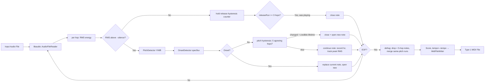

# midicapture — Design Document

> Audio-to-MIDI transcription module. Converts audio recordings (AIFF, WAV, FLAC) to Standard MIDI Files (SMF).

---

## 1. Purpose

`midicapture` is a command-line utility that analyzes audio recordings and generates **Type 1 MIDI files** (480 ticks per quarter note), compatible with Apple Logic Pro. It is the second phase of the Audio project.

The module uses:
- **libaudio**: the transcription engine — `libaudio::Transcriber` (aubio YINfft +
  spectral-flux onsets, Tier-1) and `libaudio::BasicPitch` (Core ML, Tier-2) —
  both concrete `libaudio::Analyzer`s; plus audio I/O (libsndfile) and MIDI writing.
  The monophonic aubio pipeline itself now *lives in libaudio*; midicapture is a
  thin CLI front-end that selects an analyzer.
- **Boost program_options**: Command-line argument parsing

---

## 2. Architecture

```
Audio/
├── libaudio/             # DSP library (pitch, onsets, transcription, MIDI writing)
│   ├── include/libaudio/
│   │   ├── pitch.h       # PitchDetector (YINfft, YINfast, fcomb, Schmitt)
│   │   ├── onset.h       # OnsetDetector (specflux, energy, hpsst, phase, combs)
│   │   ├── analyzer.h    # Analyzer — abstract port (audio → Score)
│   │   ├── transcriber.h # Transcriber — concrete Tier-1 aubio engine (a public Analyzer)
│   │   ├── basicPitch.h  # BasicPitch — concrete Tier-2 neural engine (a public Analyzer)
│   │   ├── audioFile.h   # AudioFileReader (libsndfile wrapper)
│   │   ├── midiFileWriter.h  # MidiFileWriter (HIR → SMF)
│   │   └── hir.h         # Note, ControlEvent, Score (HIR)
│   └── src/             # Implementation files (incl. transcriber.cpp, onnx/, basicPitch/)
├── midicapture/          # Phase 2: Audio → MIDI (thin CLI front-end)
│   ├── CMakeLists.txt   # Build config (links libaudio, Boost)
│   ├── include/midicapture/
│   │   └── corpusHarness.h       # Analyzer-agnostic 14-file corpus evaluator
│   └── src/
│       ├── main.cpp              # CLI entry point (Boost program_options; --run-corpus)
│       └── corpusHarness.cpp     # Corpus harness (recall/precision/Δ; the --analyzer switch)
└── lode/midicapture/    # Module documentation
```

---

## 3. Transcription Pipeline


```mermaid
graph LR
    A[Input Audio File] --> B[libaudio::AudioFileReader]
    B --> C[per hop: RMS energy]
    C --> D{RMS above --silence?}
    D -->|No| E[hold release-hysteresis counter]
    D -->|Yes| F[PitchDetector YINfft]
    E --> F2{releaseRun >= 3 hops?}
    F2 -->|Yes, was playing| G[close note]
    F --> H[OnsetDetector specflux]
    H --> I{Onset?}
    I -->|Yes| J[replace current note, open new]
    I -->|No| K[pitch hysteresis: 5 agreeing hops?]
    K -->|changed + credible lifetime| L[close + open new note]
    K -->|else| M[continue note: record hz, track peak RMS]
    G --> N{EOF?}
    L --> N
    M --> N
    J --> N
    N -->|No| B
    N -->|Yes| O[defrag: drop < 5-hop notes, merge same-pitch runs]
    O --> P[Score, tempo=--tempo → MidiFileWriter]
    P --> Q[Type 1 MIDI File]
```

---

## 4. State Machine (Monophonic, energy-gated)

The monophonic prototype uses a two-state machine gated on **energy**, not on
the pitch detector's confidence (YINfft reports a usable fundamental even for
noise; on rendered piano its confidence reads ~0, so it is not a usable gate).

| State | Condition | Action |
|-------|-----------|--------|
| **IDLE** | No note active | Wait for an onset on a tonal hop |
| **PLAYING** | A note is active | Record hz + peak RMS; watch for release, onset, or a stable pitch change |

Transitions:
- **IDLE → PLAYING**: onset detected on a tonal hop (RMS above `--silence`).
- **PLAYING → IDLE** (any of):
  - **release** — energy stays below `--silence − 10 dB` for `kReleaseHops = 3` hops;
  - **onset** — a new onset replaces the current note;
  - **pitch change** — `kPitchStability = 5` consecutive hops agree on a *different* pitch class, *and* the in-flight note is ≥ `kMinReplaceHops = 5` hops (younger than that the change is treated as wobble within the same note).

A note that closes with fewer than `kMinNoteHops = 5` hops is dropped (see §8).
A decaying note that is closed and re-opened hop to hop by its own wobble is
recombined into a single note by the same-pitch merge in §8.

---

## 5. Key Design Decisions

| Decision | Value | Rationale |
|----------|-------|-----------|
| **Pitch method** | YINfft (default) | Best accuracy/speed tradeoff for piano |
| **Onset method** | Spectral flux | Most reliable for piano transients |
| **Window size** | 2048 (configurable) | 43 ms at 48 kHz, good balance |
| **Hop size** | 512 (10.7 ms at 48 kHz) | Good latency vs. smoothing |
| **Silence threshold** | -40 dB (configurable) | Note on/off hysteresis level |
| **Release hysteresis** | -10 dB, 3 hops | A note disarms only after 3 quiet hops |
| **Pitch stability** | 5 hops (100 ms) | A pitch change needs 5 agreeing hops |
| **Min note lifetime** | 5 hops | Drops the wobble-fragment debris |
| **Min replace lifetime** | 5 hops | A note must be credible before it is replaced |
| **Tempo** | from `--tempo` (120) | Drives the merge gap + MIDI ticks |
| **MIDI format** | Type 1, 480 ticks/qn | Logic Pro compatible |
| **CLI library** | Boost program_options | Standard, robust, extensible |

---

## 6. CLI Interface

An input file is required, **except** in `--test` mode (which needs none) or
`--generate-test-midi-files` mode (which writes a set of files and needs no
input at all — see [testmidi.md](testmidi.md)).
When `--input` is given without `--output`, the output path defaults to
`<input>.mid` (extension replaced); in `--test` mode with no input it
defaults to `midicapture-test.mid`.

`--help` prints a POSIX-style help message with a `Usage:` line and exits — no
input file required.

```
midicapture — audio-to-MIDI transcription

Usage: ./midicapture [options] <input.aiff> [output.mid]

Main options:
  -h [ --help ]             Print usage information.
  <input.aiff>              Input audio file path (AIFF, WAV, FLAC, etc.).
  [output.mid]             Output MIDI filename (.mid).  When omitted, the
                            input filename is reused with a .mid extension.
  -o [ --output ] arg       Output MIDI file path (.mid).  (Equivalent to the
                            positional form; prefer positional for input.)
  --input / -i             Accepted but **prefer the positional form**: a
                            trailing argument after `--input` is captured as
                            the *output*, so the intended input is silently
                            lost.  See the [midicapture README](../../midicapture/README.md)
                            Known Limitations for details.
  --window-size arg (=2048) FFT window size (power of 2, default: 2048).
  --hop-size arg (=512)     Hop size between frames (default: 512).
  --silence arg (=-40)      Silence threshold in dB (default: -40) — note
                            on/off hysteresis level.
  --tempo arg (=120)        Tempo in BPM (default: 120) — drives the merge
                            gap and the MIDI tick conversion.
  --method arg (=yinfft)    Pitch detection method (default: "yinfft").
  -t [ --test ]             Sanity test: write a single middle-C note
                            (C4, velocity 100, 1s) regardless of input.
  --generate-test-midi-files
                            Generate a set of simple monophonic scale MIDI files
                            in --output-dir (default: CWD). All other options
                            are ignored.
```

> **Tier-2 builds** additionally offer the analyzer-agnostic corpus evaluator:
> `--run-corpus DIR --analyzer {basic-pitch|aubio} [--no-pitch-bends]
> [--multiple-pitch-bends] [--clean] [--ffmpeg PATH]`
> (see [tier2](../libaudio/tier2.md)).
> `--no-pitch-bends` gates basic-pitch's bend extraction (default **on** =
> Python parity); it does **not** change the onset/length/pitch/velocity
> metrics (those exclude bends) — it only stops the analyzer from attaching
> bend vectors to notes.
> `--multiple-pitch-bends` routes each distinct bent pitch to its own MIDI
> channel 1..15 (default **off** = reference parity, one channel).

Examples:
```bash
midicapture song.aiff                          # → song.mid
midicapture song.aiff output.mid               # explicit output
midicapture song.aiff -o out.mid               # explicit output via flag
midicapture --help                             # usage only
midicapture --test song.aiff                   # fixed sanity note -> song.mid
midicapture -t --output sanity.mid             # sanity note, no input needed
midicapture --generate-test-midi-files            # 14 corpus files in CWD
midicapture --generate-test-midi-files --output-dir ./test-midi
```

> ⚠️ **Prefer the positional form for the input file.** The `--input` / `-i`
> flags are registered as *aliases* of the positional name so both forms
> work, but a trailing argument after `--input` is captured by the *output*
> slot (Boost's positional slots cannot carry short flags), and the intended
> input is silently dropped.  See the [midicapture README](../../midicapture/README.md)
> Known Limitations.

---

## 7. Build

```bash
cd midicapture
mkdir build && cd build
cmake .. -DCMAKE_BUILD_TYPE=Release
cmake --build . --config Release
```

Requires: aubio, libsndfile, Boost (program_options).

---

## 8. Validation & Known Issues

The writer is **validated, not a bug** — see [writer.md](writer.md). What
remains open is transcription quality.

### Validation toolchain (decided: not ffprobe)

`ffprobe` is **not** authoritative for small MIDI files — it reports
"Invalid data" on valid ones. We validate with:
- **`midicsv <file>`** — parses to CSV; a clean parse = structurally valid.
- **`timidity -Ow out.wav <file>`** — renders audio; `Notes lost totally: 0`
  and a correctly-timed note = semantically valid.

The writer round-trips cleanly through both (53-byte `--test` file;
clean 62-byte real-transcription file on `aiffcapture/final-fantasy.aiff`).

### Transcription quality (resolved — details in defrag.md)

The long-standing Tier-1 transcription issues are all **fixed**; the symptom /
root-cause / fix write-ups, the measurements, and the YIN octave problem now
live in [defrag.md](defrag.md) (split out so both files stay under the cap):
decaying-note fragmentation (1447 → 101 on `final-fantasy.aiff`), the YIN
octave problem on weak-fundamental renders, and the old stereo segfault.
Robust octave is handled by the Tier-2 basic-pitch analyzer
([../libaudio/tier2.md](../libaudio/tier2.md)). Minor Tier-1 artifacts remain
(first note often missed; quiet decay tails fall below `--silence`) — see
[defrag.md](defrag.md) §3.

---

## 9. Cross-References

- **libaudio**: `lode/libaudio/summary.md`, `lode/libaudio/decisions.md`, `lode/libaudio/hir.md`
- **MIDI writer**: `lode/midicapture/writer.md` (SMF byte layout, invariants, `--test` flag, midicsv/timidity validation)
- **Test file generator**: `lode/midicapture/testmidi.md` (`--generate-test-midi-files`, `--output-dir`, monophonic scale ground truth)
- **MIDI format**: `lode/MIDI.md`
- **aiffcapture**: `lode/aiffcapture/summary.md`
- **Session handoff**: `lode/tmp/session-handoff-midicapture-diagnosis.md`
- **Project overview**: `lode/summary.md`
