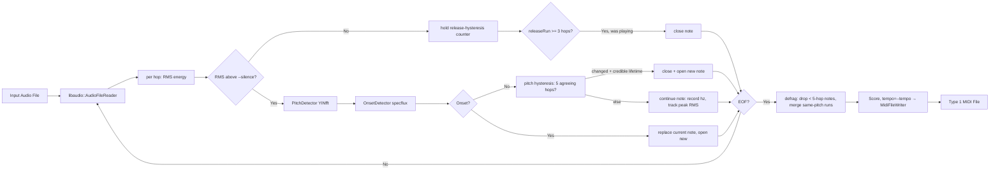

# midicapture — Design Document

> Audio-to-MIDI transcription module. Converts audio recordings (AIFF, WAV, FLAC) to Standard MIDI Files (SMF).

---

## 1. Purpose

`midicapture` is a command-line utility that analyzes audio recordings and generates **Type 1 MIDI files** (480 ticks per quarter note), compatible with Apple Logic Pro. It is the second phase of the Audio project.

The module uses:
- **libaudio**: the transcription engines — `libaudio::Transcriber` (aubio YINfft +
  spectral-flux onsets, Tier-1, monophonic) and `libaudio::BasicPitch` (ONNX/Core ML,
  Tier-2, polyphonic) — both concrete `libaudio::Analyzer`s; plus audio I/O (libsndfile)
  and MIDI writing. midicapture is a thin CLI front-end that selects an engine via
  `--model` (default: the polyphonic `basic` engine in a Tier-2 build) and writes the
  resulting HIR `Score` to a Type 1 MIDI file.
- **Boost program_options**: Command-line argument parsing

---

## 2. Architecture

```
Audio/
├── libaudio/             # DSP library (pitch, onsets, transcription, MIDI writing)
│   ├── include/libaudio/
│   │   ├── pitch.h       # PitchDetector (YINfft, YINfast, fcomb, Schmitt)
│   │   ├── onset.h       # OnsetDetector (specflux, energy, hpsst, phase, combs)
│   │   ├── analyzer.h    # Analyzer — abstract port (audio → Score)
│   │   ├── transcriber.h # Transcriber — concrete Tier-1 aubio engine (a public Analyzer)
│   │   ├── basicPitch.h  # BasicPitch — concrete Tier-2 neural engine (a public Analyzer)
│   │   ├── audioFile.h   # AudioFileReader (libsndfile wrapper)
│   │   ├── midiFileWriter.h  # MidiFileWriter (HIR → SMF)
│   │   └── hir.h         # Note, ControlEvent, Score (HIR)
│   └── src/             # Implementation files (incl. transcriber.cpp, onnx/, basicPitch/)
├── midicapture/          # Phase 2: Audio → MIDI (thin CLI front-end)
│   ├── CMakeLists.txt   # Build config (links libaudio, Boost)
│   ├── include/midicapture/
│   │   └── corpusHarness.h       # Analyzer-agnostic 14-file corpus evaluator
│   └── src/
│       ├── main.cpp              # CLI entry point (Boost program_options; --run-corpus)
│       └── corpusHarness.cpp     # Tier-2 corpus harness (recall/precision/Δ) + makeAnalyzer
└── lode/midicapture/    # Module documentation
```

---

## 3. Transcription Pipeline


```mermaid
graph LR
    A[Input Audio File] --> B[libaudio::AudioFileReader]
    B --> C[per hop: RMS energy]
    C --> D{RMS above --silence?}
    D -->|No| E[hold release-hysteresis counter]
    D -->|Yes| F[PitchDetector YINfft]
    E --> F2{releaseRun >= 3 hops?}
    F2 -->|Yes, was playing| G[close note]
    F --> H[OnsetDetector specflux]
    H --> I{Onset?}
    I -->|Yes| J[replace current note, open new]
    I -->|No| K[pitch hysteresis: 5 agreeing hops?]
    K -->|changed + credible lifetime| L[close + open new note]
    K -->|else| M[continue note: record hz, track peak RMS]
    G --> N{EOF?}
    L --> N
    M --> N
    J --> N
    N -->|No| B
    N -->|Yes| O[defrag: drop < 5-hop notes, merge same-pitch runs]
    O --> P[Score, tempo=--tempo → MidiFileWriter]
    P --> Q[Type 1 MIDI File]
```

---

## 4. State Machine (the `aubio` engine — monophonic, energy-gated)

The `aubio` engine uses a two-state machine gated on **energy**, not on the
pitch detector's confidence (YINfft reports a usable fundamental even for
noise; on rendered piano its confidence reads ~0, so it is not a usable gate).
This describes the monophonic engine only; the `basic` engine segments notes
from its neural onset/contour maps instead (see [libaudio/tier2.md](../libaudio/tier2.md)).

| State | Condition | Action |
|-------|-----------|--------|
| **IDLE** | No note active | Wait for an onset on a tonal hop |
| **PLAYING** | A note is active | Record hz + peak RMS; watch for release, onset, or a stable pitch change |

Transitions:
- **IDLE → PLAYING**: onset detected on a tonal hop (RMS above `--silence`).
- **PLAYING → IDLE** (any of):
  - **release** — energy stays below `--silence − 10 dB` for `kReleaseHops = 3` hops;
  - **onset** — a new onset replaces the current note;
  - **pitch change** — `kPitchStability = 5` consecutive hops agree on a *different* pitch class, *and* the in-flight note is ≥ `kMinReplaceHops = 5` hops (younger than that the change is treated as wobble within the same note).

A note that closes with fewer than `kMinNoteHops = 5` hops is dropped (see §8).
A decaying note that is closed and re-opened hop to hop by its own wobble is
recombined into a single note by the same-pitch merge in §8.

---

## 5. Key Design Decisions

| Decision | Value | Rationale |
|----------|-------|-----------|
| **Pitch method** | YINfft (default) | Best accuracy/speed tradeoff for piano |
| **Onset method** | Spectral flux | Most reliable for piano transients |
| **Window size** | 2048 (configurable) | 43 ms at 48 kHz, good balance |
| **Hop size** | 512 (10.7 ms at 48 kHz) | Good latency vs. smoothing |
| **Silence threshold** | -40 dB (configurable) | Note on/off hysteresis level |
| **Release hysteresis** | -10 dB, 3 hops | A note disarms only after 3 quiet hops |
| **Pitch stability** | 5 hops (100 ms) | A pitch change needs 5 agreeing hops |
| **Min note lifetime** | 5 hops | Drops the wobble-fragment debris |
| **Min replace lifetime** | 5 hops | A note must be credible before it is replaced |
| **Tempo** | from `--tempo` (120) | aubio merge gap + MIDI ticks (both engines) |
| **MIDI format** | Type 1, 480 ticks/qn | Logic Pro compatible |
| **CLI library** | Boost program_options | Standard, robust, extensible |

---

## 6. CLI Interface

An input file is required, **except** in `--test` mode (needs none) or
`--generate-test-midi-files` mode (writes a file set; see [testmidi.md](testmidi.md)).
When `--input` is given without `--output`, the output defaults to
`<input>.mid` (extension replaced); `--test` with no input uses `midicapture-test.mid`.

`--help` prints a POSIX-style usage message and exits — no input file required.

```
midicapture — audio-to-MIDI transcription

Usage: ./midicapture [options] <input.aiff> [output.mid]

Engine selection:
  --model arg (=basic)   (Tier-2) "basic" / "basic-pitch" (synonyms, the
                           polyphonic basic-pitch engine — the default) or
                           "aubio" (the monophonic engine).
  --analyzer arg         (Tier-2) Deprecated alias for --model.
  --window-size (=2048)  [aubio only] FFT window size (power of 2).
  --hop-size (=512)      [aubio only] Hop size between frames.
  --silence (=-40)       [aubio only] Silence threshold in dB (note on/off).
  --method (=yinfft)     [aubio only] Pitch detection method.
  --no-pitch-bends       [basic only] Skip basic-pitch pitch-bend extraction.
  --multiple-pitch-bends [basic only] One channel per distinct bent pitch.
  --onset-threshold <f>  [basic only] Min onset activation, 0..1 (default 0.5).
  --frame-threshold <f>  [basic only] Min frame activation, 0..1 (default 0.3).
  --min-note-len <ms>    [basic only] Min note length (default 127.7; merges
                             shorter duplicates into the predecessor).
  --min-freq <hz>        [basic only] Lowest Hz kept (default 27.5, A0).
  --max-freq <hz>        [basic only] Highest Hz kept (default 4186, C8).
  --velocity-scale <int> [basic only] Velocity = clamp(round(scale*amp), 1, 127).
  --bend-deadband <bins> [basic only] Near-flat bend floor (default 1.0).
  --no-infer-onsets      [basic only] Skip the onset-inference step (default on).
  --no-melodia           [basic only] Skip the melodia trick (default on).
  --tempo (=120)         Tempo in BPM (both engines; a playback-rate control).
  --ffmpeg (=/opt/homebrew/bin/ffmpeg)  [Tier-2] ffmpeg *binary* path: aubio
                           container-decode fallback + --clean MP3 encoding.
                           Not used by basic-pitch (in-process decode).

Corpus (Tier-2 only):
  --run-corpus DIR       Evaluate the 14-file corpus in DIR with --model.
  --clean                Regenerate the corpus assets first.
  --dump-raw-map PATH    Run basic-pitch once; write the raw stitched maps
                         (note/onset/contour + timing) to PATH as a binary
                         raw-map file. Writes no MIDI; needs a positional input.

Utility (all builds):
  -o [ --output ] arg    Output .mid.   --input / -i  Prefer positional instead.
  -t [ --test ]          Write a fixed single middle-C note; no analysis.
  --generate-test-midi-files  Write the 14-file corpus to --output-dir.
  -h [ --help ]          Usage.
```

> **Knob gating.** The aubio-only DSP knobs (window/hop/silence/method) tune
> only the `aubio` engine; basic-pitch's window and frame rate are fixed by the
> model, so they are inert there — if you pass an aubio-only knob with
> `--model basic`, the tool prints a note that it was ignored (gated on
> `!defaulted()`: boost reports `count() > 0` even for defaulted options,
> which would otherwise fire on every basic run).
> `--no-pitch-bends` / `--multiple-pitch-bends` tune only `basic` (default **on**/**off**).
> The basic-pitch **note-creation knobs** (onset/frame threshold, min-note-len,
> min/max-freq, velocity-scale, bend-deadband, --no-infer-onsets, --no-melodia)
> tune only `basic`; their defaults are the reference values, so a no-flag run is
> byte-identical to the baseline (14/14 corpus parity). The symmetric gate applies
> in reverse: pass any of these with `--model aubio` and the tool prints a note
> that it was ignored. `--midi-tempo` is deliberately not a flag — `--tempo`
> (tempoBpm) already sets the output tempo.
> `--ffmpeg` is deprecated for basic (basic-pitch decodes in-process); the note
> prints only if the flag was explicitly passed.
> **Input containers.** A container libsndfile cannot open (e.g. mp4) no longer
> aborts: the CLI prints a note and the engine decodes the file itself (basic:
> in-process via the FFmpeg libraries; aubio: the ffmpeg binary fallback), so
> `midicapture song.mp4 out.mid` is one command.
> A **Tier-1 build** omits `--model` / `--analyzer` / `--run-corpus` /
> `--dump-raw-map` / `--ffmpeg` / the pitch-bend + note-creation flags entirely.
> See the [midicapture README](../../midicapture/README.md)

Examples:
```bash
midicapture song.aiff                          # → song.mid (default model: basic)
midicapture song.aiff output.mid               # explicit output
midicapture --model aubio song.aiff out.mid    # the monophonic engine
midicapture --run-corpus ./test-midi           # evaluate the 14-file corpus (Tier-2)
midicapture --test song.aiff                   # fixed sanity note -> song.mid
midicapture --generate-test-midi-files --output-dir ./test-midi
```

> ⚠️ **Prefer the positional form for the input file.** The `--input` / `-i`
> flags are aliases of the positional name, but a trailing argument after
> `--input` is captured by the *output* slot and the intended input is silently
> dropped. See the [midicapture README](../../midicapture/README.md) Known Limitations.

---

## 7. Build

midicapture builds libaudio as a sub-project; the tier is chosen by `LIBAUDIO_ENABLE_TIER2` (default OFF).

```bash
cd midicapture
# Tier-1 (default): aubio monophonic engine only — no --model, no corpus, no ffmpeg.
mkdir build && cd build
cmake .. -DCMAKE_BUILD_TYPE=Release
cmake --build . --config Release
#   -> build/bin/midicapture

# Tier-2: adds basic-pitch (the default model), --model, --run-corpus.
mkdir ../build-tier2 && cd ../build-tier2
cmake .. -DCMAKE_BUILD_TYPE=Release -DLIBAUDIO_ENABLE_TIER2=ON
cmake --build . --config Release
#   -> build-tier2/bin/midicapture
```

Requires: aubio, libsndfile, Boost (program_options); **Tier-2 additionally** onnxruntime + a working Core ML EP + **FFmpeg (shared libraries, via pkg-config)**. The ffmpeg *binary* is still used at runtime by the aubio container fallback and `--clean` (corpus MP3 encoding).

---

## 8. Validation & Known Issues

The writer is **validated, not a bug** — see [writer.md](writer.md). What
remains open is transcription quality.

### Validation toolchain (decided: not ffprobe)

`ffprobe` is **not** authoritative for small MIDI files — it reports
"Invalid data" on valid ones. We validate with:
- **`midicsv <file>`** — parses to CSV; a clean parse = structurally valid.
- **`timidity -Ow out.wav <file>`** — renders audio; `Notes lost totally: 0`
  and a correctly-timed note = semantically valid.

The writer round-trips cleanly through both (53-byte `--test` file;
clean 62-byte real-transcription file on `aiffcapture/final-fantasy.aiff`).

### Transcription quality (resolved — details in defrag.md)

The long-standing Tier-1 (aubio) transcription issues are all **fixed**; the
symptom / root-cause / fix write-ups, the measurements, and the YIN octave
problem now live in [defrag.md](defrag.md) (split out so both files stay under
the cap): decaying-note fragmentation (1447 → 101 on `final-fantasy.aiff`), the
YIN octave problem on weak-fundamental renders, and the old stereo segfault.
Those are aubio-engine concerns. **Robust octave and polyphony come from the
`basic` (basic-pitch) engine — the default in Tier-2 builds**
([../libaudio/tier2.md](../libaudio/tier2.md)). Minor aubio artifacts remain
(first note often missed; quiet decay tails fall below `--silence`) — see
[defrag.md](defrag.md) §3.

### Build / test

- **`ctest` → “No tests were found”** on a `build-tier2` run: the ctest suite
  is registered under libaudio's subdirectory, not midicapture's, so `ctest`
  from `midicapture/build-tier2` finds none. The corpus CLI run (`--run-corpus`)
  is the real verification. **Deferred by user** (see
  [../plans/postproc-tuning.md](../plans/postproc-tuning.md)).

---

## 9. Cross-References

- **libaudio**: `lode/libaudio/summary.md`, `lode/libaudio/decisions.md`, `lode/libaudio/hir.md`
- **MIDI writer**: `lode/midicapture/writer.md` (SMF byte layout, invariants, `--test` flag, midicsv/timidity validation)
- **Test file generator**: `lode/midicapture/testmidi.md` (`--generate-test-midi-files`, `--output-dir`, monophonic scale ground truth)
- **MIDI format**: `lode/MIDI.md`
- **aiffcapture**: `lode/aiffcapture/summary.md`
- **Session handoff**: `lode/tmp/session-handoff-midicapture-diagnosis.md`
- **Project overview**: `lode/summary.md`
