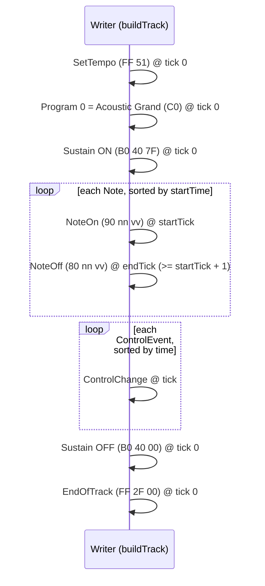

# midicapture — MIDI File Writer

> The SMF renderer in `libaudio` that turns a HIR `Score` into a binary
> Standard MIDI File. Loded alongside [summary.md](summary.md); general format
> background lives in [../MIDI.md](../MIDI.md).

---

## 1. Role & Responsibility

`MidiFileWriter` (`libaudio/include/libaudio/midiFileWriter.h`,
`libaudio/src/midiFileWriter.cpp`) is a **renderer only**. It takes a `Score`
and emits a well-formed **Type 1 SMF** (480 ticks/qn). It does not analyze
audio. Its contract:

> For **any** `Score` — even zero notes — `write()` produces a file that
> `midicsv` and `timidity` can parse and that Logic Pro can import. Validity
> never depends on transcription quality. There is no practical note-count
> limit.

---

## 2. What the Writer Emits (byte layout)

Header chunk (14 bytes):

```
MThd 00 00 00 06 | 00 01 | 00 01 | 01 E0
        ^len = 6     ^fmt 1   ^1 trk   ^480 tpq   (all big-endian)
```

Track chunk = `MTrk` + 4-byte big-endian length + event bytes. The declared
length must **exactly equal** the number of event bytes that follow.

Event order for a `Score` at tempo *T* (see [../MIDI.md](../MIDI.md) §5 for
varlen/delta encoding):



Every event is preceded by a **variable-length delta-time** that is always
**≥ 0**; the absolute timeline is **monotonic** — a non-increasing tick yields
a delta of 0, never negative.

---

## 3. Invariants the Writer Enforces

| # | Invariant | How it's enforced |
|---|-----------|-------------------|
| 1 | One `NoteOn` + one `NoteOff` per note | `buildTrack` emits exactly one on, then one off, per `Note`. |
| 2 | Non-negative varlen delta-time before every event | `emit()` calls `appendVarLen(delta)`; deltas clamped to `≥ 0`. |
| 3 | Big-endian multi-byte fields | `writeUint16` / `writeUint32` emit MSB first. |
| 4 | `MTrk` length == actual event bytes | Length is written from `track.size()` *after* building the track. |
| 5 | `FF 2F 00` always present, always last | `buildTrack` appends `endOfTrack()` at the end. |
| 6 | No running status | Every payload carries its own status byte. |
| 7 | Velocities in [1,127]; pitches in [0,127] | `clamp7` (pitch) + `min(127, max(1, v))` (velocity floor/cap). |
| 8 | Note duration ≥ 1 tick | If `offTick <= onTick`, off is bumped to `onTick + 1`. |

### Seconds → ticks

```cpp
uint32_t secondsToTicks(double s, double bpm) {
    return s <= 0 ? 0
                   : static_cast<uint32_t>(
                       std::llround(s * 480 * (bpm / 60.0)));
}
```

With 480 tpq @ 120 BPM → `s × 960`. **Do not divide by 60 twice.**

---

## 4. Concrete Example (the `--test` sanity note)

`midicapture --test <in>` writes a fixed, input-independent note:
**middle C (C4, MIDI 60), velocity 100, 0→1 s** at 120 BPM. Track stream:

```
00 FF 51 03 07 A1 20   SetTempo 500000 µs/qn = 120 BPM
00 C0 00               Program 0 (Acoustic Grand)
00 B0 40 7F            Sustain ON
00 90 3C 64            C4 NoteOn vel 100   (delta 0)
87 C0 80 3C 64         C4 NoteOff          (delta 960 ticks = 1 s)
00 B0 40 00            Sustain OFF
00 FF 2F 00            EndOfTrack
```

= 31 event bytes → 14 (header) + 8 (`MTrk` + len) + 31 = **53 bytes**.

`midicsv` of the file parses cleanly:

```
Header 1,1,480  Tempo 500000  Program_c 0  Ctrl 64/127
Note_on 0,60,100  (tick 960) Note_off 0,60,100  Ctrl 64/0  End_track
```

`timidity -Ow out.wav <file>` renders a ~1 s note with `Notes lost totally: 0`
(audible, correctly timed, nothing dropped).

---

## 5. The `--test` Flag

`midicapture --test <in>` (also `-t`) ignores the input audio, runs no
analysis, and writes the sanity note above. Output defaults to `<input>.mid`
(or `midicapture-test.mid` if no input is given). It is the stable round-trip
target for validating the writer + `midicsv`/`timidity` **independently of the
still-WIP transcription pipeline**.

```cpp
if (testMode) {                      // in midicapture/src/main.cpp
    Score score = makeSanityScore(tempoBpm);   // C4 / vel 100 / 1 s
    MidiFileWriter w(outputPath);
    if (w.write(score)) { /* print bytes + validation hint */ return 0; }
    return 1;
}
```

---

## 6. File I/O & Failure Handling (RAII)

`Impl` owns a `FILE*`. `write()` opens the file, writes header + track, then
**`fclose` on success** (flushes the stdio buffer to disk) and **nulls the
handle**; the destructor closes it only on failure paths. This
`fclose`-then-null pattern is load-bearing — without it the buffer never
flushed and unit tests saw truncated files.

```cpp
if (fclose(f) != 0) return false;
impl_->file = nullptr;   // destructor must not double-close
```

---

## 7. Validation Toolchain (what "correct" means)

Project decision: **do not gate on `ffprobe`** — it is unreliable for small
MIDI files (reports "Invalid data" on valid ones). Validate with:

- **`midicsv <file>.mid`** — parses to CSV; a clean parse = structurally valid.
- **`timidity -Ow out.wav <file>.mid`** — renders audio; `Notes lost totally: 0`
  plus a correctly-timed note = semantically valid.

The unit test `test_midiWriter` (`libaudio/tests/test_main.cpp`) asserts the
raw bytes: header magic / length / format / tracks / division, `MTrk` length ==
remaining bytes, **first event is `00 FF 51`** (regression guard against the
historical garbage-prefix bug), note bytes present, EOT trailer, and
empty-score structural validity.

---

## 8. Cross-References

- [summary.md](summary.md) — module overview, pipeline, CLI, open transcription issue
- [../MIDI.md](../MIDI.md) — SMF format, varlen, events, piano specifics
- [../libaudio/hir.md](../libaudio/hir.md) — `Score` / `Note` / `ControlEvent` (writer input)
- [../libaudio/summary.md](../libaudio/summary.md) — the library module that hosts the writer
- [../tmp/session-handoff-midicapture-diagnosis.md](../tmp/session-handoff-midicapture-diagnosis.md) — historical diagnosis (superseded)
