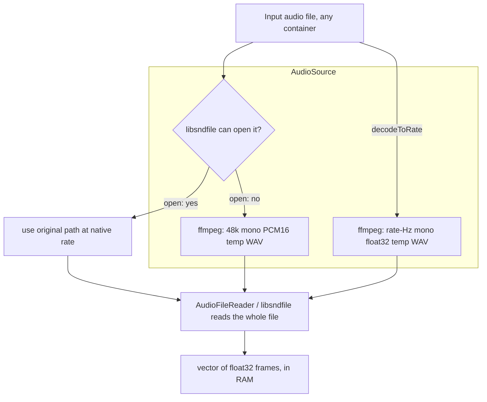

# Plan: In-memory (in-process) audio decode — replace the ffmpeg shell-out

> **Status: 📋 Plan (not started).** Per the user's Q3 decision, the current
> ffmpeg-based decode is **kept as-is** for now; this is the *follow-up track*
> that makes the read path fully in-process. `basic-pitch-tier1.md` §2(2)
> references this as the way to remove ffmpeg as a Tier-2 hard requirement.
> See [basic-pitch-tier1.md](basic-pitch-tier1.md) for the tier-flattening track
> and [../libaudio/tier2.md](../libaudio/tier2.md) for the BasicPitch front-end.

---

## 1. Current state (how ffmpeg is used today)

`AudioSource` (`libaudio/include/libaudio/audioDecode.h`) is the **single place in
libaudio that shells out to ffmpeg, for reading.** It is a Tier-1-layer RAII value
(always compiled; it needs only libsndfile + an ffmpeg *path*, no ONNX dep). It
resolves *one* input path to a path an `AudioFileReader` (libsndfile) can open.

Two entry points, two different needs:

| Entry point | When | What ffmpeg produces | Consumer |
|---|---|---|---|
| `open(path, ffmpeg)` | most containers open directly; only an *unreadable* container falls back | 48 kHz mono **PCM16** throwaway WAV | aubio `Transcriber` (container fallback) |
| `decodeToRate(path, rate, ffmpeg)` | a model wants a *fixed* input rate | `<rate>` Hz mono **float32** throwaway WAV | `BasicPitch` (22050 Hz) |

The shared worker, `ffmpegDecodeToTemp`, runs (via **`std::system`**):

```
<ffmpeg> -y -loglevel error -i '<input>' -ac 1 -ar <rate> -c:a <codec> '<inputDir>/<stem>.<tag>.wav'
```



**Properties — keep or change:**
- **Probe-first** (keep): a file libsndfile reads natively is used as-is — no
  re-encode, no resample, no disk write. Most sources take this path.
- **Whole-file buffered** (change): ffmpeg writes a *complete* WAV, then libsndfile
  reads the *whole* thing into RAM. Two full-sized copies exist (disk temp + vector).
- **Shell-out** (change): `std::system` spawns a subprocess; needs an ffmpeg binary
  on disk **and** a *writable* directory next to the input (the temp lives there).
- **Non-streaming** (change): no chunked decode/resample today.

## 2. The goal (Q3)

Make the read path **in-process, in-memory, streaming**:
1. **No shell-out** — decode inside libaudio; drop the ffmpeg binary dependency.
2. **No throwaway temp files** — no disk write next to the input, no `unlink`, no
   write-permission failure mode.
3. **Lower peak RAM** — don't hold a disk WAV *and* a full in-memory buffer; decode
   + resample in a single pass into the one buffer the consumer needs.
4. **Robust** — same inputs, same `Score` as today (it is a front-end swap).

> **Honest RAM note:** the `BasicPitch` model is a *sequence* model — it needs the
> full clip at 22050 Hz mono f32. At that format, 1 min ≈ 5.3 MB, 5 min ≈ 26 MB —
> a modest, *unavoidable* buffer. The real wins are removing the **disk round-trip**
> and the **double buffer**, not streaming the model input itself. True streaming
> (feed windows to the model as they decode, for very long / live input) is a
> separate, larger redesign and is **not** part of this plan.

## 3. Candidate approaches

All candidates are **permissively licensed** (public domain) and **single-file** —
matching the project's "local, dependency-light" constraint and the existing
precedent of vendoring (`midicsv-1.1/` in midicapture).

| Library | License | Decodes | In-process resample | Streaming | Notes |
|---|---|---|---|---|---|
| **miniaua** | public domain | WAV, AIFF, MP3, FLAC, Ogg/Vorbis | **yes** (`ma_resampler`: SINC / linear / cubic) | **yes** (`ma_decoder`, frame-by-frame) | most complete: decoders **and** a quality resampler together |
| **dr_libs** | public domain | WAV, MP3, FLAC, … (modular `dr_*`) | no (pair with stb_resample) | yes | modular; no built-in resampler |
| **stb_vorbis + stb_resample** | public domain | Vorbis (+ stb_wav for WAV only) | stb_resample (yes) | frame-by-frame | assemble from parts; no MP3/FLAC |

**Recommendation: miniaua** — it bundles *both* the decoders libsndfile covers and
the exotic ones (MP3 / FLAC / Vorbis) **and** a quality streaming resampler, so one
header replaces *both* the ffmpeg decode **and** the resample step. `dr_libs` is the
runner-up if we prefer modular, but it lacks a resampler.

**Resample strategy** (the one quality knob): ffmpeg currently does an anti-aliased
multirate resample. miniaua's `ma_resampler` (SINC, high cutoff) is an in-process
equivalent:
- `decodeToRate(22050)` (BasicPitch): SINC resample to 22050 mono float32.
- `open()` 48k fallback (aubio): SINC to 48000 mono — or skip resample and hand the
  consumer its native rate (aubio resamples internally); decide in Q4.

## 4. Open questions (resolve before implementing)

1. **Which library** — miniaua (recommended) / dr_libs / stb_*?
2. **Vendored vs. dependency** — add the single file to `libaudio/src/` and compile
   it in, or `FetchContent`? Precedent says vendor.
3. **Where it lives** — extend `audioDecode.cpp` (replace the ffmpeg branch with an
   in-process decode) or a new internal unit? Keep `AudioSource`'s public API
   unchanged if possible.
4. **`open()` native path** — keep libsndfile as the native reader (it is already a
   hard dep) and use miniaua only for the *fallback*; or fully replace libsndfile
   with miniaua for one decode path?
5. **API shape for in-memory** — today `AudioSource` is a *path* view. An in-process
   decode yields a *buffer*. Does `AudioSource` grow a `path | vector<float>` union,
   or do we add a sibling `AudioBuffer` type?
6. **`--ffmpeg` flag** — once the read path is in-process, does midicapture drop the
   `--ffmpeg` flag, or keep it inert / deprecated?
7. **Parity gate** — the swap must be *byte-identical or better* on the 14-file
   corpus (no recall/precision regression) before it lands. Reuse the corpus harness
   + `midicsv` / `timidity` round-trip as the gate.

## 5. Scope & non-goals

- **Scope:** `libaudio/src/audioDecode.cpp` + `AudioSource` (and a new internal
  decode + resample unit if a chosen library warrants it). Tier-1-layer, no ONNX.
- **Non-goal:** does **not** change the build, the two-tier structure, the ONNX
  model, or the engines. Orthogonal to the tier-flattening track
  ([basic-pitch-tier1.md](basic-pitch-tier1.md)). Per Q3, **not implemented this
  session** — this is the next step.

## 6. Payoff when done

- Removes the **ffmpeg binary hard-requirement** for a Tier-2 build (the last
  non-ONNX external runtime dep of the default `basic` engine).
- Removes **throwaway temp files** + the "input dir must be writable" failure mode.
- Cuts **peak memory** (no disk-WAV + in-RAM double buffer) and **startup time**
  (no subprocess).
- Makes the read path fully **local and self-contained**: an exotic container → a
  `Score` with no external tool.

## 7. Cross-references

- [basic-pitch-tier1.md](basic-pitch-tier1.md) — the tier-flattening track (this is its §2(2) "ffmpeg as a hard requirement" sub-item)
- [../libaudio/tier2.md](../libaudio/tier2.md) — the `BasicPitch` front-end that consumes `decodeToRate(22050)`
- [../libaudio/decisions.md](../libaudio/decisions.md) — the libsndfile / aubio wrapper decisions
- **Source of truth:** `libaudio/include/libaudio/audioDecode.h` + `libaudio/src/audioDecode.cpp`
