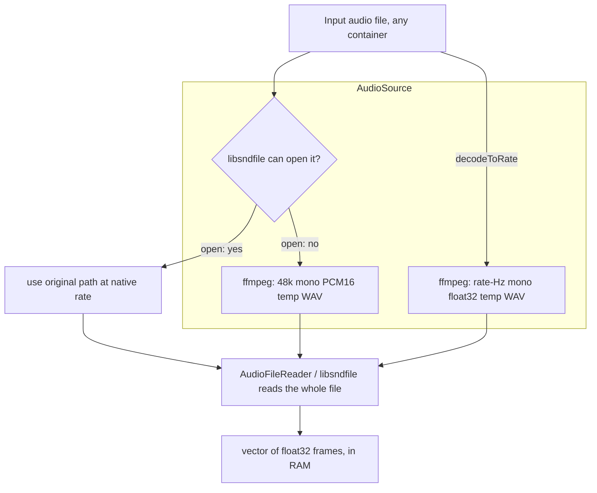

# Plan: In-process (miniaua) audio decode — replace the ffmpeg shell-out

> **Status: ✅ Superseded.** The miniaua approach below was superseded by the
> **FFmpeg shared-library link** plan, which is now implemented. See
> [ffmpeg-link.md](ffmpeg-link.md) for the current (in-process, linked) decode.

---

## 1. Current state (how ffmpeg is used today)

`AudioSource` (`libaudio/include/libaudio/audioDecode.h`) is the **single place in
libaudio that shells out to ffmpeg, for reading.** It is a Tier-1-layer RAII value
(always compiled; it needs only libsndfile + an ffmpeg *path*, no ONNX dep). It
resolves *one* input path to a path an `AudioFileReader` (libsndfile) can open.

Two entry points, two different needs:

| Entry point | When | What ffmpeg produces | Consumer |
|---|---|---|---|
| `open(path, ffmpeg)` | most containers open directly; only an *unreadable* container falls back | 48 kHz mono **PCM16** throwaway WAV | aubio `Transcriber` (container fallback) |
| `decodeToRate(path, rate, ffmpeg)` | a model wants a *fixed* input rate | `<rate>` Hz mono **float32** throwaway WAV | `BasicPitch` (22050 Hz) |

The shared worker, `ffmpegDecodeToTemp`, runs (via **`std::system`**):

```
<ffmpeg> -y -loglevel error -i '<input>' -ac 1 -ar <rate> -c:a <codec> '<inputDir>/<stem>.<tag>.wav'
```



**Properties — keep or change:**
- **Probe-first** (keep): a file libsndfile reads natively is used as-is — no
  re-encode, no resample, no disk write. Most sources take this path.
- **Whole-file buffered** (change): ffmpeg writes a *complete* WAV, then libsndfile
  reads the *whole* thing into RAM. Two full-sized copies exist (disk temp + vector).
- **Shell-out** (change): `std::system` spawns a subprocess; needs an ffmpeg binary
  on disk **and** a *writable* directory next to the input (the temp lives there).
- **Non-streaming** (change): no chunked decode/resample today.

## 2. The goal (Q3)

Make the read path **in-process, in-memory, streaming**:
1. **No shell-out** — decode inside libaudio; drop the ffmpeg binary dependency.
2. **No throwaway temp files** — no disk write next to the input, no `unlink`, no
   write-permission failure mode.
3. **Lower peak RAM** — don't hold a disk WAV *and* a full in-memory buffer; decode
   + resample in a single pass into the one buffer the consumer needs.
4. **Robust** — same inputs, same `Score` as today (it is a front-end swap).

> **Honest RAM note:** the `BasicPitch` model is a *sequence* model — it needs the
> full clip at 22050 Hz mono f32. At that format, 1 min ≈ 5.3 MB, 5 min ≈ 26 MB —
> a modest, *unavoidable* buffer. The real wins are removing the **disk round-trip**
> and the **double buffer**, not streaming the model input itself. True streaming
> (feed windows to the model as they decode, for very long / live input) is a
> separate, larger redesign and is **not** part of this plan.

## 3. Candidate approaches (miniaua — SUPERSEDED)

All candidates are **permissively licensed** (public domain) and **single-file** —
matching the project's "local, dependency-light" constraint and the existing
precedent of vendoring (`midicsv-1.1/` in midicapture).

| Library | License | Decodes | In-process resample | Streaming | Notes |
|---|---|---|---|---|---|
| **miniaua** | public domain | WAV, AIFF, MP3, FLAC, Ogg/Vorbis | **yes** (`ma_resampler`: SINC / linear / cubic) | **yes** (`ma_decoder`, frame-by-frame) | most complete: decoders **and** a quality resampler together |
| **dr_libs** | public domain | WAV, MP3, FLAC, … (modular `dr_*`) | no (pair with stb_resample) | yes | modular; no built-in resampler |
| **stb_vorbis + stb_resample** | public domain | Vorbis (+ stb_wav for WAV only) | stb_resample (yes) | frame-by-frame | assemble from parts; no MP3/FLAC |

**Why superseded:** miniaua does not decode AAC/M4A, WMA, or other formats
present in real-world recordings and the MAESTRO dataset. The user chose to
link to the FFmpeg shared libraries instead (see [ffmpeg-link.md](ffmpeg-link.md)),
which covers all formats and uses the same libswresample engine the ffmpeg CLI
applies today (identical audio quality).

## 4. Open questions (resolved by the ffmpeg-link plan)

1. ~~Which library~~ → **FFmpeg shared libraries** (libavformat, libavcodec, libswresample, libavutil)
2. ~~Vendored vs. dependency~~ → **linked** (Homebrew dylibs, pkg-config discovery)
3. ~~Where it lives~~ → `libaudio/src/ffmpegDecode.cpp` (new internal unit)
4. ~~`open()` native path~~ → unchanged (libsndfile native read stays; the in-process decode replaces only the `decodeToRate` path)
5. ~~API shape for in-memory~~ → `decodeToMonoFloat(path, rate) → std::vector<float>` (free function; `AudioSource` stays a path view)
6. ~~`--ffmpeg` flag~~ → **deprecated** (still accepted, ignored, prints a notice)
7. ~~Parity gate~~ → 14-file corpus must produce identical/better notes

## 5. Cross-references

- [ffmpeg-link.md](ffmpeg-link.md) — **the active plan** (FFmpeg library link, implemented)
- [basic-pitch-tier1.md](basic-pitch-tier1.md) — the tier-flattening track
- [../libaudio/tier2.md](../libaudio/tier2.md) — the `BasicPitch` front-end
- [../libaudio/decisions.md](../libaudio/decisions.md) — the libsndfile / aubio wrapper decisions
