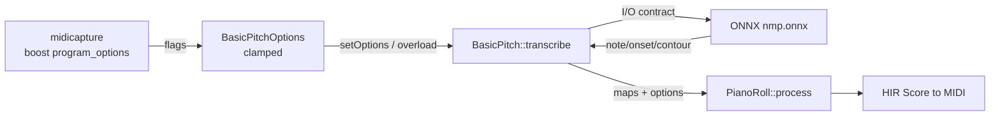

# Plan: Tunable post-processing for the basic-pitch (NMP) path

> **Status: 🔧 In progress — Phase 2 (knob promotion + clamps + Boost flags) done
> & committed; Phases 3–5 pending.** Code freeze is **lifted** (the user authorized
> implementation). Phase 1 added the model-front-end factor (`Impl::runFrontEnd`),
> `BasicPitch::getRawPredictions`, a dependency-free binary raw-map format
> (`rawMap.{h,cpp}`), and the `midicapture --dump-raw-map` flag. Phase 2 promoted
> the four note-creation knobs out of `ModelDescriptor` into `BasicPitchOptions`
> (same defaults), added the missing knobs (min/max frequency, the `melodia` /
> `infer-onsets` gates, `midiTempo`), clamped each per §6, and wired Boost flags
> into `midicapture` (the direct path) — all byte-identical to the no-flag baseline
> (14/14 corpus parity; corpus metrics unchanged). This plan is the source of truth
> for the remaining phases. Short-term priority is **improving the basic-pitch NMP
> post-processing** over the Tier-1 path; **Tier-1 improvement is deprioritized**
> for now.

---

## 1. Motivation (user's words, distilled)

- Real recordings are the interesting case, not synthetic. **The defaults may not
  be ideal** for a given recording; at minimum they should become *adjustable
  knobs*, outside the model-fixed knobs.
- In the normal course of `midicapture`, the user wants to **deviate from the
  defaults** when that may yield a better transcription.
- The knobs travel: `midicapture` accepts them via the usual **Boost
  program_options** mechanism and they must **work their way into libaudio** —
  parameters for functions that don't have them yet.
- **Clamp** inputs to sensible ranges; the existing values become the defaults.
- Provide a **separate method for experimentation**, alongside the one the test
  harness uses (which stays at fixed, byte-identical parity defaults).
- The in-process FFmpeg work ([ffmpeg-link.md](ffmpeg-link.md), no temp files)
  makes fast per-file experimentation far more achievable.

## 2. Where the knobs live today (two structs)

| Knob | Value | Lives in | User-facing today? |
|------|-------|----------|--------------------|
| onset threshold | 0.5 | `ModelDescriptor` (contract) | no |
| frame threshold | 0.3 | `ModelDescriptor` (contract) | no |
| min note length | 11 frames (~127.7 ms) | `ModelDescriptor` (contract) | no |
| velocity scale | 127 | `ModelDescriptor` (contract) | no |
| include pitch bends | true | `BasicPitchOptions` | yes (`setOptions`) |
| multiple pitch bends | false | `BasicPitchOptions` | yes (`setOptions`) |
| bend deadband | 1.0 bin (our improvement) | `BasicPitchOptions` | yes (`setOptions`) |

`ModelDescriptor` is the fail-fast I/O description of what the *model*
expects/produces (sample rate, window, hop, bins, MIDI offset). `BasicPitchOptions`
is how a *given* model output is turned into notes. Today the four note-creation
knobs sit in the **wrong struct** (the contract, not the options).

## 3. The move: promote the 4 note-creation knobs

Move `onsetThreshold / frameThreshold / minNoteLenFrames / velocityScale` out of
`ModelDescriptor` into `BasicPitchOptions` (same defaults). Upstream's own
`predict()` treats exactly these as *user parameters*, not contract — so this
mirrors the reference and keeps the descriptor a pure I/O contract. The existing
`BasicPitchOptions` + `setOptions` seam is the proven pattern; the new knobs ride
the same path. `BasicPitch` keeps a private `ModelDescriptor` for I/O and an
`options_` for the knobs.

## 4. Full tunable parameter list (+ proposed clamps)

Defaults = upstream `predict()` / `model_output_to_notes()`. **New** = not a
parameter in our port today (always-on or skipped).

| Param | Type | Default | Proposed clamp | New? |
|-------|------|---------|----------------|------|
| onset_threshold | float | 0.5 | [0, 1] | no |
| frame_threshold | float | 0.3 | [0, 1] | no |
| minimum_note_length | ms | 127.7 | [20, 2000] | no (we store frames; convert) |
| minimum_frequency | Hz | 27.5 (A0) | [27.5, 4186] | **yes** |
| maximum_frequency | Hz | 4186 (C8) | [27.5, 4186] | **yes** |
| midi_tempo | bpm | 120 | [20, 300] | no |
| include_pitch_bends | bool | true | — | no |
| multiple_pitch_bends | bool | false | — | no |
| melodia_trick | bool | true | — | **yes** (now always-on) |
| infer_onsets | bool | true | — | **yes** (now always-on) |
| bend_deadband | bins | 1.0 | [0, 40] | no (ours) |
| velocity_scale | int | 127 | [1, 127] | no |

**Min/max frequency is the lever to add first:** upstream `constrain_frequency`
zeroes activations outside the band; our port previously *skipped it* (no band
requested). Exposing it suppresses bass rumble / inharmonic low bins on real
recordings — a direct precision knob.

**Inclusive band (deliberate deviation):** our `constrainFrequency` keeps the bins
in `[lo, hi]` *inclusive* (zeroing `[0, lo)` and `[hi+1, nBins)`), whereas upstream
is *half-open* (it zeroes `frames[:, max_idx:]`, dropping the `max_freq` column
itself). This makes the literal defaults `27.5/4186` keep **all 88** bins — a true
no-op, hence byte-identical. For a non-default `max_freq` we keep one extra top bin
vs upstream; a benign, sane "endpoints included" choice.

## 5. Non-tunable (fixed by the model — do not expose)

| Constant | Value | Why fixed |
|----------|-------|-----------|
| sample rate | 22050 Hz | model trained at this rate |
| window samples | 43844 (2 s) | model input shape |
| hop / front-pad | 36164 / 3840 | window geometry (overlap 30 fr × 256) |
| frame rate | 86 fps | 22050 // 256 |
| note / contour bins | 88 / 264 | model output width (CQT in-model) |
| MIDI offset | 21 (A0) | bin 0 = A0 (CQT layout) |
| FFT hop / magic align | 256 / 0.0018 | frame→time mapping |
| bend window / gauss | 25 / σ5 | bend-estimator geometry |
| bend scale / ticks | 4096 / 8192 | MIDI CC#0 range (±2 semitones) |

## 6. Clamping policy

- **Float knobs:** non-finite (NaN/±inf) → **error** (fail fast, like the
  descriptor's `validate*`). Out of clamp range → **clamp to the bound + a
  one-line note to stderr** (never a silent accept, never a crash).
- **Bool knobs:** parse `0/1/false/true` (Boost `bool`); no clamp.
- **Tempo / length / freq:** same clamp+note rule. All defaults preserve current
  behavior — a run with **no** flags is byte-identical to today's run.

## 7. Boost CLI plumbing (midicapture → libaudio)

New optional flags on the `basic` engine (omitted = default): `--onset-threshold`,
`--frame-threshold`, `--min-note-len` (ms), `--min-freq`, `--max-freq`,
`--midi-tempo`, `--velocity-scale`, `--bend-deadband`, `--melodia off`,
`--no-infer-onsets`. They build a `BasicPitchOptions`, passed to
`BasicPitch::setOptions` (or a new `transcribe(path, options)` overload). The
`!defaulted()` gating already used for the inert-aubio-knob notice applies here
(only clamp/act on a knob the user actually passed).

## 8. Separate experimental method (alongside the harness)

The **test harness** path stays at fixed parity defaults (byte-identical gate).
Add a second entry point that takes explicit `BasicPitchOptions`:
- a `BasicPitch::transcribe(path, const BasicPitchOptions&)` overload (or an
  `Analyzer::transcribe(path, AnalyzerParams)` carrying the options), so an
  experiment can sweep knobs without touching harness defaults.
- The CLI in §7 is one consumer; a small sweep/eval driver (scratch `lode/tmp`
  script) is another.

## 9. Raw-map dump — ✅ done (Phase 1)

Tuning is only fast if we don't re-run the model per knob. Upstream
`run_inference(debug_file=…)` / `predict` dumps the **unwrapped note/onset/contour
maps** to JSON. We add the C++ equivalent, `BasicPitch::getRawPredictions(path)`:
run the model **once** → return the 3 stitched maps + `annotNFrames`.

`RawPredictions` (`rawMap.{h,cpp}`) = the 3 stitched maps + `annotNFrames` + a
`haveContour` flag. The **resampled audio is deliberately *not* stored** — it is
cheap and deterministically regenerable from the source on demand; the maps (the
expensive model run) are the artifact to cache. It has a small, dependency-free
**binary** file format (little-endian; magic `LRM1` + version; `writeRawPredictions`
/ `readRawPredictions`) that round-trips byte-for-byte (proven by a model-free
round-trip check in the Tier-2 smoke test). `midicapture --dump-raw-map PATH <input>`
runs the model once and writes that file (no MIDI). The model front-end is factored
into a shared `Impl::runFrontEnd` (used by both `transcribe` and
`getRawPredictions`), so a no-flag `transcribe` stays **byte-identical** to the
baseline. **Highest-leverage enabler for the whole plan.**

## 10. Ground truth: MAESTRO v3.0.0 + the overfitting guardrail

- **MAESTRO** = real **Yamaha** piano recordings; the MIDI is the **key-strike**
  data the piano captured while playing, and the audio is the *same* clean
  performance (real room acoustics, **no added noise**). 1276 files (train 962 /
  val 137 / test 177), 10 years (2004–2018), duration median ~7 min up to ~44 min.
  The **full download is present** (120 GB at repo root `maestro-v3.0.0/`; the user
  set it read-only; it is git-ignored and *never* copied into tracked dirs — it is
  freely redistributable only as *public* metadata + sha256, never as audio bytes).
  GT = key-strike MIDI → recall / precision / recall@octave. *Quality profile* (a
  1276-row sweep + a 30-file audio sample): the recordings are **clean / tonal**
  (spectral flatness −43…−59 dB), **mellow** (~55–95% of energy in 200 Hz–1 kHz;
  little above 4 kHz; centroid ~520 Hz median), **dynamic** (LRA ~15 LU median), and
  consistently 16-bit stereo at 44.1 kHz (1043) / 48 kHz (233) — a *warm piano*
  dataset trait, **not** degradation. (An earlier draft of this section wrongly
  called the audio "degraded," conflating it with the basic-pitch paper's
  *robustness-on-tainted-audio* experiments; the magenta page makes no such claim.)
- **Overfitting trap:** a `timidity` render has *free* GT (the source MIDI **is**
  the GT) but a **different instrument personality** than the model was trained on
  — valid for *relative* comparison only, not absolute quality.
- **Fixed tuning set:** ~30–50 stratified MAESTRO files (duration / note-density /
  register / dynamics; **not** tempo — the MIDI tempo meta is a uniform **120**
  placeholder across all 1276, so it carries no signal) **plus** `timidity` renders
  mixed in, with a sha256 manifest. **`--fuzz`** random-pick mode for coverage.
  MAESTRO pieces are long → budget for runtime, or sample the shorter `test`-split
  works first. Because the tempo meta is a placeholder, a GT matcher over it must
  **duration-match** (rescale GT note times so the GT total = the audio total)
  before scoring.
- **The GT reader is now trustworthy** (the MIDI file-handling fix): the
  standards-compliant `MidiFileReader` reads a MAESTRO MIDI correctly, so the
  sweep's duration-match rescale is a near-no-op (**F ≈ 1.0** on a 1293-note /
  96 s file) — an earlier F ≈ 0.2 was an artifact of a reader that mis-parsed
  running status, not a basic-pitch timing bug (the GT is registered to its
  audio).

## 11. The NMP post-processing options menu (what the knobs unlock)

“map-level” acts on the NMP; “note-level” on decoded notes.

| Layer | Technique | Notes |
|-------|-----------|-------|
| map-level | per-channel temporal smoothing | damp frame-map jitter before thresholding |
| map-level | adaptive / per-channel relative thresholds | or a front-end input normalization (upstream has none) |
| map-level | onset hysteresis + max note length | the frame_thresh walk: dual threshold, cap length |
| note-level | defrag port (same-pitch short-gap merge) | **the known precision sink (68.2%)** |
| note-level | velocity from onset-frame peak + compression | better dynamic range than column-mean |
| note-level | bend-curve smoothing / hysteresis | cleaner pitch-bend tracks |

Source **separation / demuxing** is **parked** — the user is focused on a single
instrument class for now (basic-pitch's limit). **Priority: (1) tunable params +
clamps — unlocks all of the above → (2) robustness on real recordings →
(3) precision (defrag).**

## 12. Upstream watch-list (pinned at `fa5997a` / #185)

We re-port the *pinned* path; upstream is **actively maintained** → periodic
`git pull` on `libaudio/external/basic-pitch`. Watch `note_creation.py`,
`inference.py` (`get_audio_input` / `unwrap_output`), `constants.py`; re-verify the
weights **SHA-256** gate after any pull. Candidate newer model: **Piano2FA**
(Spotify, unverified — check ONNX availability + license).

## 13. New-model policy (user's)

NMP's virtue is **small** → embedding in the binary is acceptable. **Other models
load from disk** as ONNX. All models must be, or be convertible, to **ONNX**
(one-time conversion via `tf2onnx` / `torch2onnx` — “that should be in our toolbox;
if it isn't, fetch it”), since **onnxruntime is the point**.

## 14. Phasing (suggested order)

1. ✅ **Raw-map dump** (§9) — done: `getRawPredictions` + binary raw-map format +
   `--dump-raw-map`; the model front-end is factored so a no-flag `transcribe` is
   unchanged (the 14-file corpus stays byte-identical).
2. ✅ **Knob promotion** descriptor→options + clamps + Boost flags (§3/4/5/6/7) —
   done: the four note-creation knobs now live in `BasicPitchOptions`; the missing
   knobs (min/max frequency, the `melodia`/`infer-onsets` gates, `midiTempo`) are
   added; each is clamped per §6; Boost flags wired into `midicapture`'s direct
   path. A no-flag run stays byte-identical (14/14 corpus parity; metrics
   unchanged); `--midi-tempo` is intentionally not a flag (redundant with
   `--tempo`).
3. ✅ **Separate experimental method** + a sweep driver (§8) — done: the
   `transcribe(path, options)` overload + `AnalyzerParams` (harness defaults
   undisturbed) and the `--sweep` MAESTRO GT driver (runs the model once, re-
   decodes the raw-map under a one-knob-at-a-time grid, scores vs `--gt` with a
   duration-match rescale).
4. **MAESTRO GT harness** + fixed set + `--fuzz` (§10) — the `--sweep` harness
   + a 12-file MAESTRO set are done; `--fuzz` (random-pick) and the larger
   stratified set remain.
5. The **options-menu techniques**, highest-leverage first (§11).

> **MIDI file-handling fix** (a user-directed task, not a numbered phase): the
> reader is now standards-compliant (running status, per-segment tempo, malformed
> → loud abort) and the writer emits canonical running status; both the corpus
> harness and the sweep's GT readers fail loudly on invalid MIDI. The 14-file
> corpus gate stays metric-identical. See
> [../midicapture/writer.md](../midicapture/writer.md).

## 15. Port completeness (the honest “is it a complete port?”)

The **transcription path is complete and faithful** to the pinned commit:
in-process decode+resample+mono → window → overlap-stitch → all of
`note_creation` (constrain-frequency, infer-onsets, peak-detect, reverse-time walk,
melodia, min-len, velocity, frame→time) → `get_pitch_bends` → MIDI emission. The
CQT lives *inside* the ONNX model; the front-end only resamples + windows. Now
ported (Phase 2): the min/max-frequency band (`constrainFrequency`, inclusive) and
the `melodia` / `infer-onsets` gates (on by default = the reference; off via the
`--no-melodia` / `--no-infer-onsets` flags). **Not ported:** `sonify_*` (unneeded —
we use timidity / waterfall). The raw-map dump is a **binary** file (§9), not
upstream's JSON. Upstream may have moved past the pin; new models are disk-loaded
ONNX per §13.

---
*Companion state: [../libaudio/tier2.md](../libaudio/tier2.md) (corpus numbers,
phasing), [../midicapture/summary.md](../midicapture/summary.md) (CLI, §8),
[ffmpeg-link.md](ffmpeg-link.md) (the in-process decode that enables §1).*
