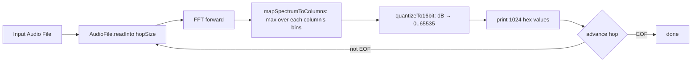

# waterfall — Design Document

> Frequency-analysis tool. Reads an audio file and renders a SONAR-style
> waterfall of its acoustic energy as a scriptable text format.

---

## 1. Purpose

`waterfall` is a command-line utility that reads an audio file and renders a
**frequency analysis of its acoustic energy over time** as a SONAR-style
waterfall: frequency left-to-right, time top-to-bottom, one row per time
slice. It is the third phase of the Audio project.

The display is SONAR-shaped, but the analysis is a **spectral analysis**: a
forward FFT per row (via libaudio), with the magnitude spectrum quantized to
16-bit integers and printed as hex.

The module uses:
- **`libaudio::FFT`**: forward FFT (magnitude + phase) per row.
- **`libaudio::AudioFileReader`**: audio file I/O (via libsndfile).
- **Boost program_options**: command-line argument parsing.

---

## 2. Architecture

```
Audio/
├── libaudio/             # DSP library (FFT, pitch, onsets, MIDI writing)
│   └── include/libaudio/
│       ├── fft.h         # FFT (forward/inverse, magnitude + phase)
│       └── audioFile.h   # AudioFileReader (libsndfile wrapper)
├── waterfall/            # Phase 3: Audio → frequency waterfall (text)
│   ├── CMakeLists.txt    # Build config (libaudio, Boost)
│   └── src/
│       └── main.cpp      # Entry point: CLI, FFT loop, quantization, output
└── lode/waterfall/       # Module documentation
```

`main.cpp` is the entire analysis tool. File I/O goes through
`libaudio::AudioFileReader` directly (no per-module wrapper). All libaudio
public types live in `namespace libaudio`; `main.cpp` uses
`using namespace libaudio;` to bring them into scope.

---

## 3. Column Grid

The columns follow the MIDI note grid: **128 notes × 8 bands = 1024
columns**. The 128 is the number of representable MIDI notes; each note is
split into 8 bands from low to high.

- Column `c` falls within **note** `c / bandsPerNote` and **band**
  `c % bandsPerNote`.
- Column center frequencies are laid out **linearly across the Nyquist**:
  `noteWidth = nyquist / 128`, `bandWidthHz = noteWidth / bandsPerNote`, and
  column `c`'s center is at
  `(noteIndex + (bandIndex + 0.5)/bandsPerNote) * noteWidth`.
- A column's value is the **maximum** FFT magnitude over the bins that fall
  inside its `[center - bandWidth/2, center + bandWidth/2]` band.

This means a column's horizontal position encodes both *which MIDI note* and
*which band within that note* — a spectrogram binning aligned to the MIDI
keyboard rather than a uniform linear frequency sweep.

---

## 4. Analysis Pipeline



For each row: read `hopSize` samples (zero-padded at EOF), forward-FFT, map the
spectrum onto the 1024 columns, quantize each to 16-bit, print. The hop equals
the FFT window (one hop per row), so consecutive rows overlap by a full window
when the window is wide — each row still contains at least one sample.

---

## 5. Quantization (the "grayscale" step)

Each column magnitude is converted to dB and mapped **linearly in dB** (a
logarithmic quantity) onto the 16-bit range between a floor and a reference:

```
level16 = round( clamp( (db - floorDb) / (refDb - floorDb), 0, 1 ) * 65535 )
```

- `floorDb = -60` (fixed; maps to `0000`).
- `refDb` (maps to `FFFF`): either `--ref-db` verbatim, or the **auto-scale**
  peak (see below).

Mapping in dB is what preserves dynamic range: acoustic energy spans a huge
range, and a linear-in-amplitude mapping would crush everything into a couple
of dark levels. (aubio ships its own `aubio_grayscale` for the same reason.)

---

## 6. Key Design Decisions

| Decision | Value | Rationale |
|----------|-------|-----------|
| **Output** | Text: header line + one line per row | Scriptable (`awk`/`cut`/`grep`); no binary format to parse |
| **Cell encoding** | 16-bit unsigned, 4-hex-digit, space-separated | `0000`–`FFFF`, unambiguous, easy to diff/replay |
| **Columns** | 128 × bands-per-note (default 8 → 1024) | Matches MIDI note grid; aligns to keyboard |
| **Column center freqs** | Linear across Nyquist, grouped by note | Simple, covers full audible range, note-aligned |
| **Hop** | = window size (power of two) | aubio requires a power-of-two hop; one hop/row = max overlap |
| **Time slice unit** | milliseconds, a `double` | `--time-slice 10` and `2.78` both valid; maps to hop |
| **Scaling** | Auto-scale to file peak by default | Loud files don't saturate to `FFFF`; peak → `FFFF` |
| **CLI** | Boost program_options | Consistent with midicapture; robust, extensible |

---

## 7. CLI Interface

```
waterfall — audio frequency analysis

Usage: waterfall [options] <input.aiff>

Options:
  --help                     Print this message.
  --window-size <int>        FFT window size, power of two (default: 2048).
  --time-slice <float>       Row duration in milliseconds (default: 10).
  --bands-per-note <int>     Bands per MIDI note (default: 8).
  --ref-db <float>           Full-scale reference level in dB (default: 0).
  --no-auto-scale            Use --ref-db verbatim instead of auto-scaling.
```

`<input.aiff>` is a single positional argument (any libsndfile format).
`--help` prints usage and exits — no input required.

Examples:
```bash
waterfall recording.aiff > waterfall.txt
waterfall --time-slice 2.78 --window-size 4096 recording.aiff > fine.txt
waterfall --no-auto-scale --ref-db -12 recording.aiff | less
```

---

## 8. Build

```bash
cd waterfall
mkdir build && cd build
cmake .. -DCMAKE_BUILD_TYPE=Release
cmake --build .
```

Executable lands in `build/bin/waterfall`. Requires aubio, libsndfile, Boost
(program_options). `libaudio` is pulled in as a sibling subdirectory and built
automatically (it compiles with a few pre-existing `-Wconversion` warnings of
its own; the waterfall sources are warning-clean under `-Wall -Wextra
-Wpedantic -Wconversion -Wsign-conversion`).

---

## 9. Output Example (abridged)

```
sampleRate=48000 timeSliceMs=10.000000 hopSize=2048 ... refDb=38.295300 autoScale=1 col0=11.718750 col1=35.156250 ...
BF22 DA9D FB69 FB69 EBC8 EBC8 C578 C578 DD0C DD0C D686 D686 ...
0000 0000 0000 0000 0000 0000 0000 0000 0000 0000 ...
```

The first data row shows a bright spectrum (many mid/high values); a silent
row is all `0000`.

---

## 10. Verification & Known Behavior

- **Builds warning-free** (our two sources) and links against libaudio + Boost.
- All 84 libaudio unit tests pass after the change.
- **Tested** on `aiffcapture/final-fantasy.aiff` (loud) and
  `1000Hz_Sine_0dB.aiff`: header + rows render; fractional `--time-slice` and
  `--window-size 4096` (→ `numBins=2049`) behave correctly; auto-scale shows a
  real spectral shape rather than a `FFFF` wall.

### Known behaviors (not bugs)

- **`1000Hz_Sine_0dB.aiff` has a long silent lead-in.** The first rows are
  legitimately all `0000`; real signal appears later in the file. This is a
  property of the test file, not the tool.
- **Loud / clipping files read `FFFF` under `--no-auto-scale --ref-db 0`.**
  Correct — the signal genuinely reaches full scale. Auto-scale (default)
  avoids this by normalizing to the file peak.
- **`hop = window`**, so there is no independent hop control. The number of
  rows is `ceil(totalFrames / windowSize)`. A separate `--hop-size` option
  could be added later, but the power-of-two constraint and the
  `--time-slice`→hop mapping make a fixed hop the simpler choice for now.

---

## 11. Cross-References

- **libaudio**: `lode/libaudio/summary.md`, `lode/libaudio/decisions.md`
  (`FFT` and `AudioFileReader` are the two modules waterfall consumes).
- **midicapture**: `lode/midicapture/summary.md` (the other consumer of the
  shared `audioFile` wrapper).
- **aiffcapture**: `lode/aiffcapture/summary.md` (source of the test AIFFs).
- **Project overview**: `lode/summary.md`
